# 1.Description

## 1.1. What is the perception framework?

* When we write an app, we often start from scratch to build the entire project. This involves not only writing the main function entry point, but also managing interactions and transmissions between functional modules, process priorities and calls, and data synchronization, among other things. This is not only a complex task but also requires a high level of expertise from software engineers. High functional demands can lead to frequent module issues, making bug tracking difficult. Furthermore, due to the short cycle of different tasks, poor code reusability can lead to a lot of redundant code, severely impacting project quality and development efficiency.

* To address these issues and pain points, the added framework module can effectively solve architectural problems, allowing algorithm or software development engineers to focus on writing algorithms or logic. Specific functional modules can be cohesively encapsulated as Operators or Ops, greatly improving development efficiency and reducing the probability of individual issues.

## 1.2. What should a good application framework include?
* Functional configuration module (√2022.1)
* Data management and synchronization module (√2022.1)
* Resource scheduling module (CPU √2022.1)
* Security monitoring module (√2023.10)
* Algorithm encapsulation module (√2022.1)
* Multi-platform support (√2022.1)
* Related toolkits (√2022.6 Visualization tools)
* Logger (√2022.4)
* Certain

## 1.3 Introduction of the perception framework

* The following diagram shows the code modules of the entire framework, with comments on the modules, related parameters, and functions in the header files. Below is a detailed explanation of each code module.

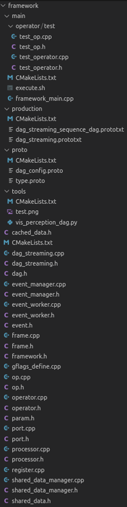

* `main`: This is the entry point for the entire application built using the framework. Depending on requirements, you can either reuse framework_main and execute.sh to start the application or develop your main function to meet specific application entry needs.
* `operator`: Users only need to define one or more operators/ops. The data flow arrangement and application execution requirements can be achieved through DAG configuration.
* `production`: This directory contains configurations related to an executable project. Typically, a single configuration file confirms overall functionality, such as cvs_dag_config.prototxt, lidar_od_dag_config.prototxt, etc.
* `proto`: This defines configuration files and types, with dag_config.proto defining the information included in a DAG configuration file, and type.proto defining some basic types.
* `tools`: Provides related toolkits for visualizing DAG files and graphically displaying the DAG flow.
* `shared_data.h`: Defines the data structure in the data flow, including data name, size, status, and event management. cache_data.h extends SharedData to define specific data in the data flow and provides related interfaces for data acquisition and distribution. CacheData is a template that can wrap any data type, primarily using custom Frame to transfer specific objects.
* `dag.h/dag_streaming.h`: Defines modules for parsing, sorting, linking, and checking DAG data, and arranges and starts defined DAG data flows.
* `Event`: The basic recording unit of data flow in the framework architecture. It records the time, upper and lower relationships of the current data frame, etc., managed by event_manager. It triggers all operators' execution through EventWorker, executing operators from upstream data and passing results to downstream defined by the event.
* `Frame`: Concept of a frame, carrying all necessary data and information. It supports data serialization and deserialization, records data flow time and sender, and logs the executor's name in the footprint after passing through the executor (Operator) for monitoring data flow and troubleshooting.
* `framework.h`: Basic header file.
* `gflags_define`: Uses gflag to define some parameters, replacing hardcoded values or macros.
* `Op`: A small functional unit for serial execution, facilitating cohesive functionality. An Operator can contain one or more Ops.
* `Operator`: Encapsulates larger Operators. Operators are launched by EventWorker and contain a Processor for serial execution of Ops, supporting parallel needs.
* `Port`: Core of data scheduling, linking data relationships between Operators, and waiting or binding related data as needed.
* `Processor`: Contains one or more Ops to control Op execution.

## 1.4. Architecture Overview

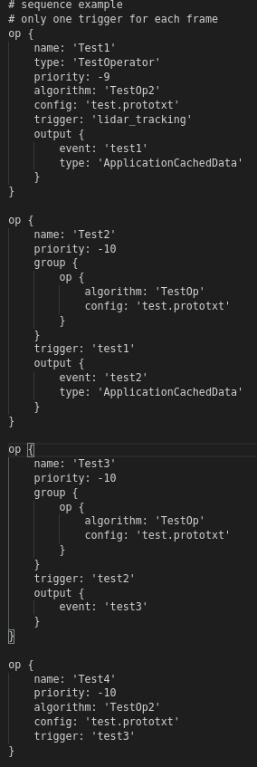

The `app_config.png` shows a functional module configuration file, and the right diagram shows the associated data flow.

Operator Test1 executes the TestOp2 algorithm, outputting test1 (type: ApplicationCachedData). test1 triggers Operator Test2 to execute the TestOp algorithm, outputting test2 (type: ApplicationCachedData). test2 triggers Operator Test3 to execute the TestOp, outputting test3 (automatically inferred type based on test1 and test2). test3 triggers Operator Test4 to execute TestOp2, completing the program execution.


This gives a rough understanding of how programs designed with the framework architecture execute.


## 1.5. Operator Relationships

* The diagram below shows the relationships between various modules in the framework architecture.

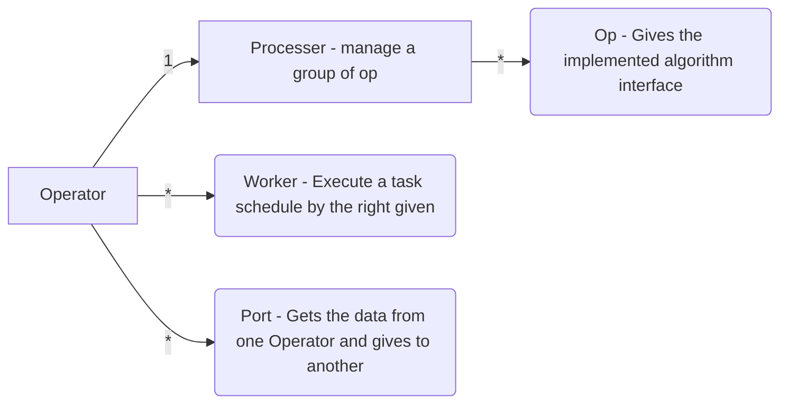

* The framework also manages the data flow between Operators, with four types of data described in the diagram below.

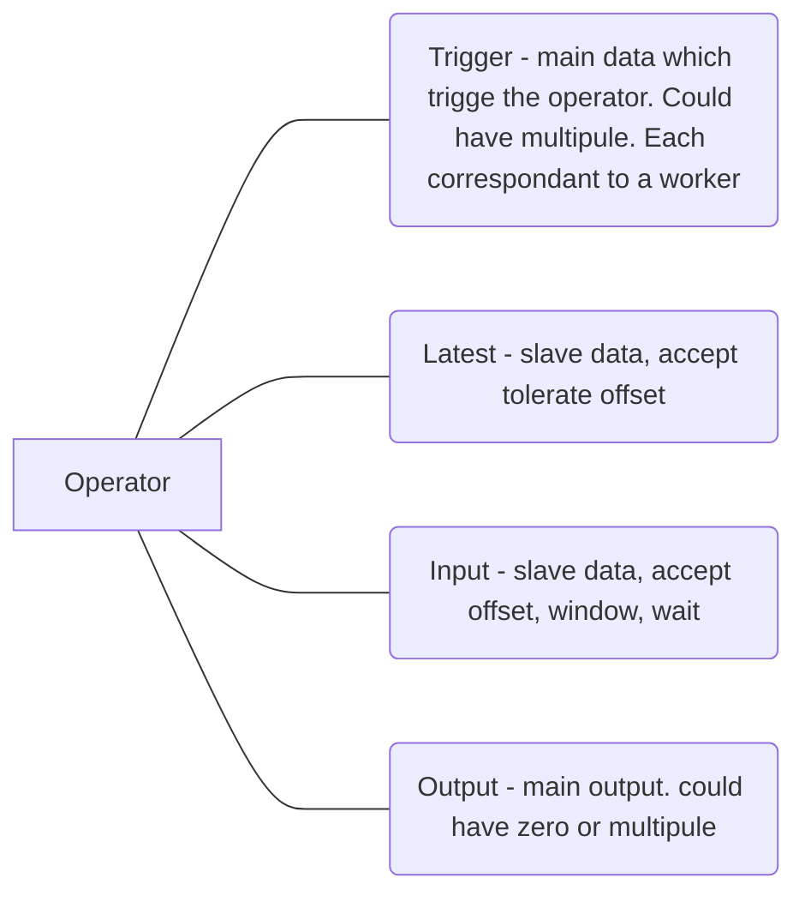

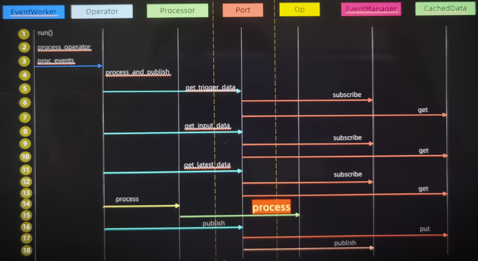

## 1.6. CPU Resources
* Priority Definition
	EventWorker encapsulates specific algorithm tasks.
	Thread is a CPU thread with configurable priority.
* Op Dependencies Strategy: A set of strategies ensuring Op execution.
	WAIT: Waits for another Op to complete. If the Op is already done, it doesn’t wait; if it’s still running, it waits for the remaining time (default mode).
	BLOCK: Forces staggered Op execution. If the Op is done, it doesn’t wait; if running, it waits for a fixed time.
	BUNDLE: Ensures data synchronization, improving binding success rate.

## 1.7. Data Management Module

There are two types of `CachedData`: `StaticCachedData`(fixed frequency) and `DynamicCachedData` (variable frequency). Both inherit from CachedData.

The diagram provides a detailed example.

Op offers a parameter manager for dynamically adding related parameters without pre-definition. Use get_param to get parameters and values.

When using input data, synchronized data can be obtained by setting several parameters of the input based on the trigger data time: input_offset, input_window, input_wait.

Data is saved sequentially by time, read according to trigger_event->timestamp + input_offset. For StaticCachedData, the data is read according to the maximum offset input_window and waits up to input_wait seconds.

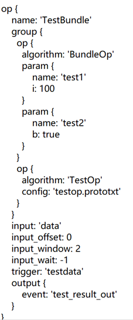

## 1.8. Custom Development

* Extending development using the Framework is straightforward, requiring just three steps:

a. Develop your own Operators and Ops based on examples in operator/test and complete registration.
b. Configure the dag_config.prototxt file as needed to define the data flow.
c. Add your data structure in Frame if additional data is needed.

## 1.9. Visual DAG Tool
To intuitively see the entire data flow and relationships, the framework provides a visualization tool to view module relationships. The diagram shows how to use the tool, e.g.

``` python
python vis_perception_dag.py -i dag_streaming.prototxt -o dag_streaming.png
```

After executing the command, you can open `dag_streaming.png` to see the general result.

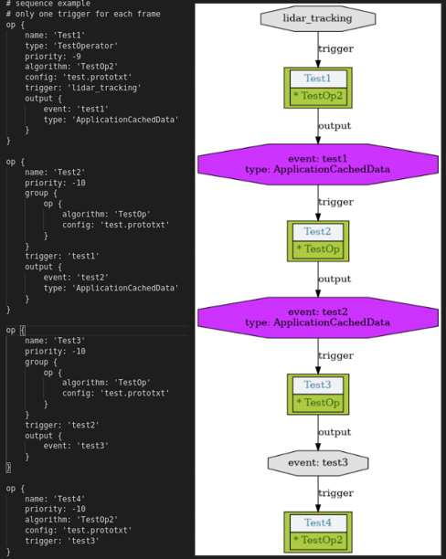
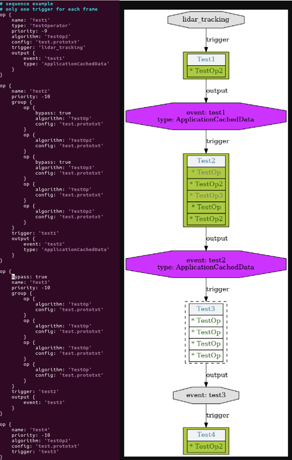

# 2. How to use

## 2.1. Build

* Set env for different platform
`export PLATFORM=X86`  `export TAG=1604`  `export TAG=1804` for X86
`export PLATFORM=TDA4` `export TAG=0702`  `export TAG=0703` `export TAG=0703_HI` for TDA4
`export PLATFORM=A6` `export TAG=""` for A6

`./build.sh` build the project.
`./build.sh clean` clean the build.
run `./build.sh help` to see the details.


## 2.2. Release
* If the build successed, all the release are in the `build_dist` folder.

## 2.3. help menu
./build.sh help

```
Usage:
    ./build.sh [OPTION]

Options:
    all: run all
    build: run the code build
    clean: clean the code build
    cov: run the code test coverage
    check_code: run the code style check
```

## 2.4. Custom Define

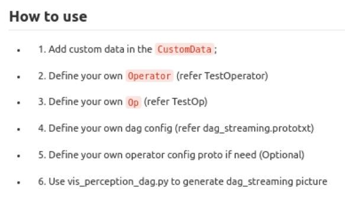

### 2.4.1 Defining Your Data Structure
For data structures that need to be passed, such as point clouds (pcl::PointCloud), images (cv::Mat), matrices (eigen), etc., encapsulate the data into a struct and add it to CustomData. For different products, it is recommended to use macros for selective compilation to prevent CustomData from becoming too large.

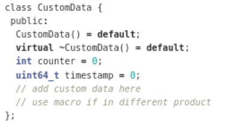

### 2.4.2 Customizing Operator
Generally, non-starting point Operators do not require extra definition and default to using Operator.

Only starting points need custom Operators, either triggered by external signals (e.g., ROS topics, CYBER topics, MQTT topics) or capable of self-generating execution starting points.
Periodic execution can be triggered using the method in TestOperator.

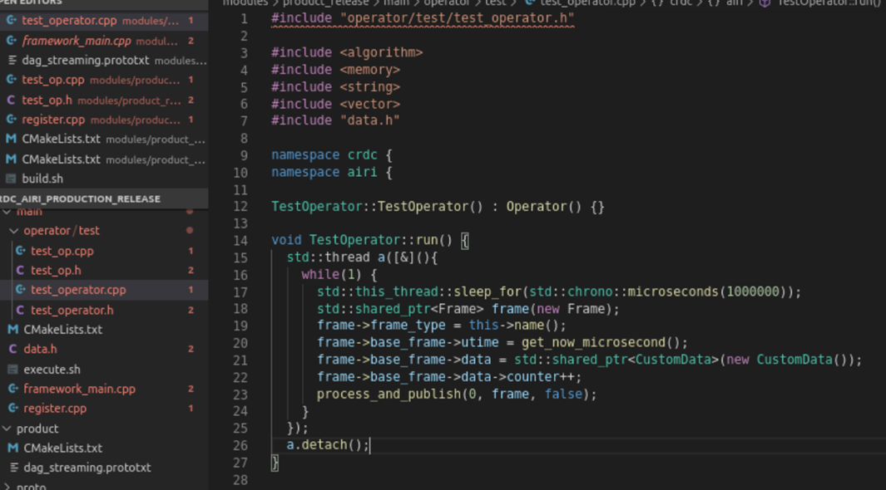

### 2.4.3 Customizing Op
Customizing Op is the main algorithm encapsulation class. Typically, our algorithm modules are extended and encapsulated as Ops. Detailed Op descriptions and inputs/outputs are discussed in previous sections. The diagram shows an example from test.

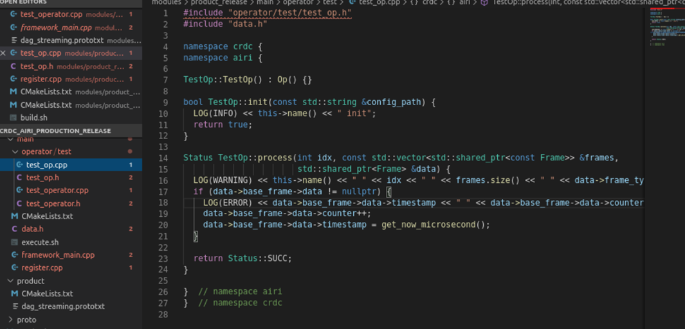

### 2.4.4 Customizing Data Flow
After defining all Operators and Ops, use the dag_streaming configuration to link the required Operators and Ops. The diagram shows an example. 

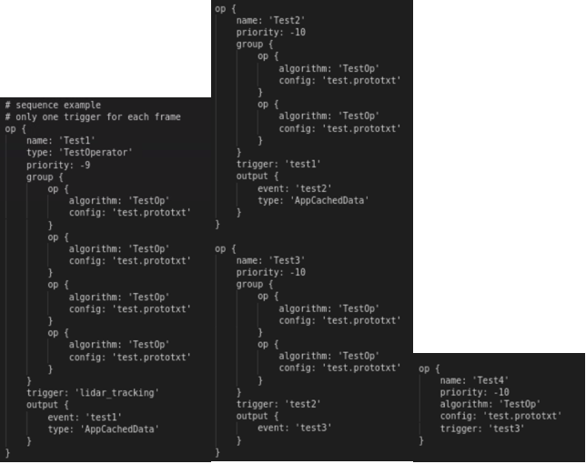

Use execute.sh for execution testing after completion.

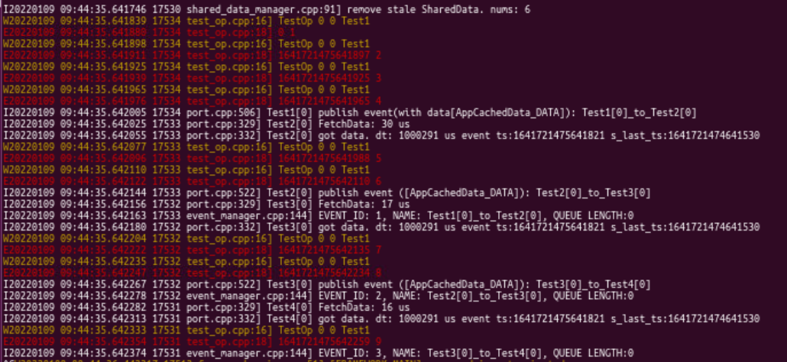

### 2.4.5 Op Configuration
Op provides a prototxt file input for configuring functions with parameters.

### 2.4.6 Configuration Updates
Remember to use scripts to update the data flow images.

### 

## 3. Module

### 3.1. common
1. singleton
2. thread
3. factory
4. concurrent_queue
5. concurrent_object_pool

### 3.2. framework
* The framework is used to create application.
* If the build successed. use `execute.sh` in the `build_dist/build_dist/crdc_airi_common/bin/` to execute the app the default config is param `build_dist/crdc_airi_common/params/framework/production/dag_streaming.prototxt`
* `tools/vis_perception_dag.py` could be used to generate `DAG picture`.
* 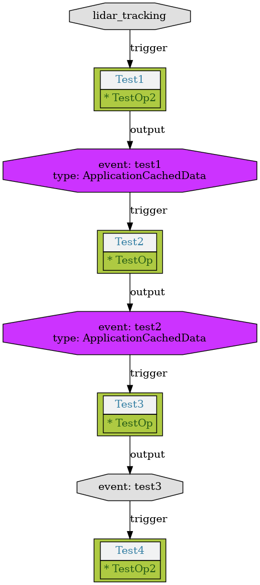. 
* Use command `python vis_perception_dag.py -i [input_dag_file_path] -o [output_picture_file_path]`
